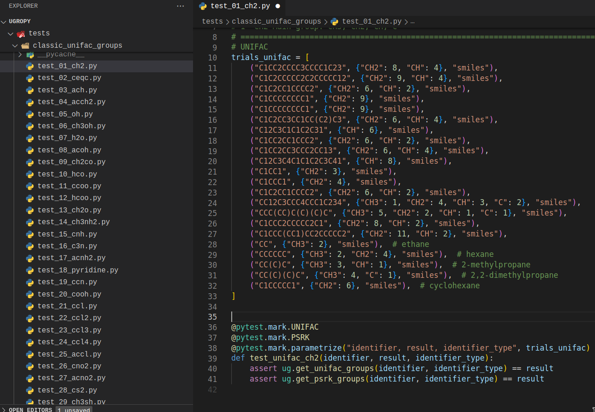
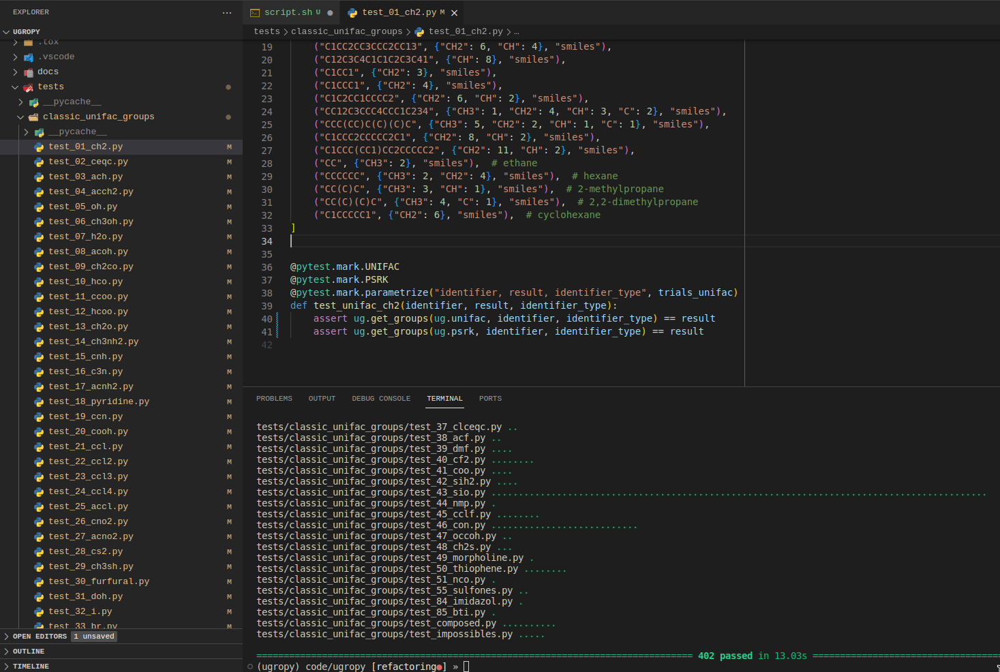

A Salvador se le ocurrió que queria cambiar el API de su librería `ugropy`.

Las funciones:

```python
    import ugropy as ug
    
    ug.get_unifac_groups(identifier, identifier_type)
    ug.get_psrk_groups(identifier, identifier_type)
```

Serían reemplazadas por una única funcion:

```python
import ugropy as ug

ug.get_groups(ug.unifac, identifier, identifier_type)
ug.get_groups(ug.psrk, identifier, identifier_type)
```

Por lo que en sus archivos de test debe cambiar todas las lineas que llamen a
las funciones obsoletas por la nueva y única función. No parece tan grave, pero
a Salvador le gusta testear:



Como se puede ver la cantidad de archivos de test es inmensa. Salvador tendria
que reemplazar a mano todas las lineas:

```python
assert ug.get_unifac_groups(identifier, identifier_type) == result
assert ug.get_psrk_groups(identifier, identifier_type) == result
```

Con:

```python
    assert ug.get_groups(ug.unifac, identifier, identifier_type) == result
    assert ug.get_groups(ug.psrk, identifier, identifier_type) == result
```

En cada uno de los archivos.

Las chances de cometer un error y quedarse con las corneas calcinadas son muy
altas si uno hace esta tarea a mano. Por lo tanto, podemos usar las
herramientas aprendidas y decirle a la computadora que resuelva el problema por
nosotros. Hacemos un script de terminal:

```shell
#!/bin/bash

# Define la ruta del directorio que contiene los archivos .py
dir="./tests/classic_unifac_groups"

# Itera sobre todos los archivos .py en el directorio
for file in "$dir"/*.py; do
    # Realiza el reemplazo en cada archivo utilizando sed
    sed -i 's/assert ug.get_unifac_groups(identifier, identifier_type) == result/assert ug.get_groups(ug.unifac, identifier, identifier_type) == result/g' "$file"
    sed -i 's/assert ug.get_psrk_groups(identifier, identifier_type) == result/assert ug.get_groups(ug.psrk, identifier, identifier_type) == result/g' "$file"
done
```

Lo guardamos como script.sh en el directorio principal de `ugropy` y lo
corremos con:

```shell
    bash script.sh
```



El color amarillo es debido a que se nos indica que todos los archivos fueron
modificados. En el editor se ve que las lineas fueron cambiadas como
corresponde y en la terminal vemos que todos los test funcionaron.

**PRO TIP (SI YA SE HIZO EL SEMINARIO DE `git`)**  
Antes de ejecutar el script.sh, se guardaron los cambios hasta ese momento en
un commit para que en caso de que el script no funcionara según se pretendía,
se pudiera deshacer todo lo que el script hubiera hecho con facilidad.

